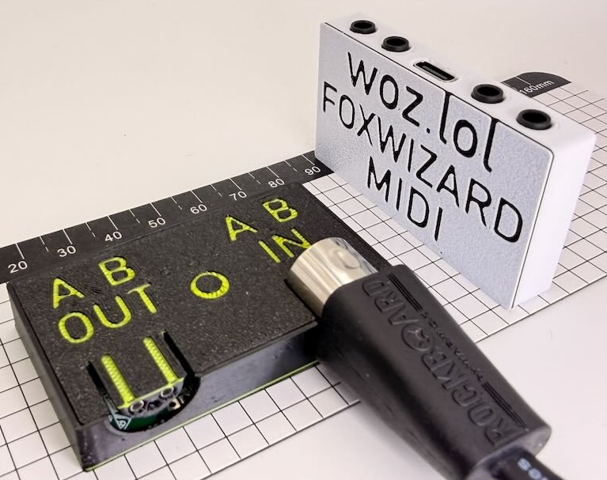
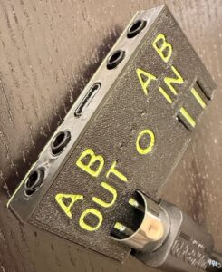
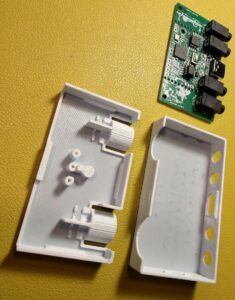
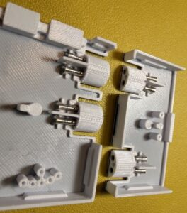
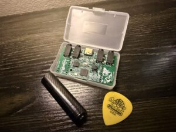
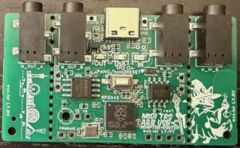
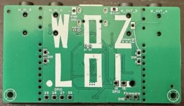

# Foxwizard Mini MIDI Multitool

The smallest complete USB MIDI adapter you can buy. USB-C + TRS A&B + DIN
adapter and router.

Remap MIDI with no computer. DAWless essential. Break off the sides and
hide it inside old gear for an easy USB upgrade.

## Features

- So small the board fits in a GBA game case. Break off the sides to make
  it even smaller. Add USB to old gear.
- Super easy web interface to program it (Foxwizard Patchling). Route any
  channel to any other, pipe CCs, block messages, transpose, split, do
  mono/poly tricks, and more.
- Configurable front button for on-the-fly panic, pitch bend, mod,
  octave, CC, or trigger note.
- 3 adjustable-brightness indicator lights gently fade in and out, rather
  than blinking distractingly.
- Works as a passive DIN to TRS MIDI A to B adapter too, no power or USB
  needed when used this way.
- For all TRS & TS MIDI types, plus our own patent-pending Half-DIN port
  for universal classic DIN compatibility. MIDI only needs 2 of the 5
  pins.
- Metal-reinforced high-strength PETG enclosure survives squishes.
- Easy solder pads if you want to put it inside an old keyboard or
  something you want to add USB MIDI to. Perfect module for mods. 6
  RP2040 GPIO pads too, can be Arduino programmed by shorting the two
  Firmware pads.

What other adaptors can't do: route and remap MIDI without a computer.

## Gallery

## Links

- Product page: https://woz.lol/foxwizard
- Configurator (Foxwizard Patchling): [`mmm_web_interface/`](mmm_web_interface/)
- Full manual: [`MANUAL.md`](MANUAL.md)
- SysEx protocol: [`SYSEX_PROTOCOL.md`](SYSEX_PROTOCOL.md)
